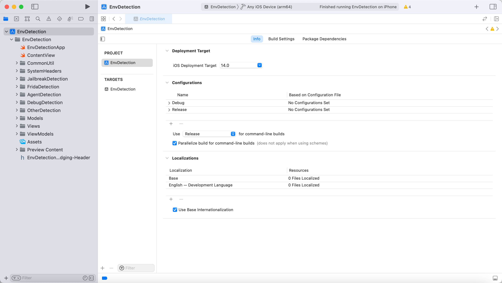
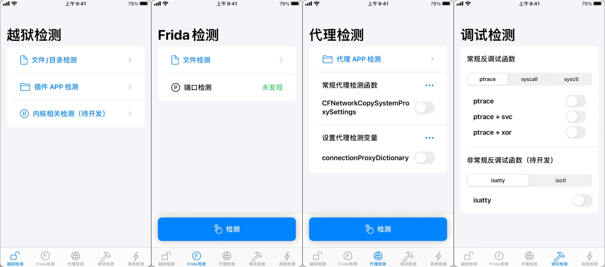

# iOSEnvDetection

## 一、软件&硬件环境

- **Xcode：Version 13.3 (13E113)；**
- **iPhone：iPhone 7(越狱)，iOS 14.4.2；**
- **编程语言：Swift + OC + C；**

****

## 二、EnvDetection 简介

> **项目是基于 SwiftUI 绘制的界面，最低支持的系统版本是 iOS 14，主要是因为 OC 画界面短时间学不会，所以低版本的 iOS 系统就不支持了。功能实现是用 `OC + C`。**

****

## 三、功能介绍（更新中）

| 功能             | 介绍                                                         | 已开发                                                       | 待开发                     |
| ---------------- | ------------------------------------------------------------ | ------------------------------------------------------------ | -------------------------- |
| 越狱检测         | 检测设备越狱之后产生的 `文件/目录`， 通过 `NSFileManager`、`access`、`stat` 、`lstat`、`statfs`、`open`、`fopen` 函数检测 `文件/目录` 的状态， 由于有很多需要检测的文件，暂时只列出了 5 个左右的 `文件/目录`。 检测越狱之后常用的插件 APP。 | 文件/目录检测 插件 APP 检测                             | 内核相关检测               |
| Frida检测        | 检测 Frida 的相关文件同样使用了 `NSFileManager`、`access`、`stat` 、`lstat`、`statfs`、`open`、`fopen` 函数。 | 文件检测 端口检测                                       | 进程检测 内存特征检测 |
| 代理检测         | 当前只使用了 `CFNetworkCopySystemProxySettings` 函数检测代理状态。 设置 `connectionProxyDictionary` 变量，可以防止 Burp、Charles 抓包工具抓包。【仅限设置系统代理的时候防止抓包，第三方代理工具仍然可以抓得到包】 检测越狱之后常用的代理 APP。 | `CFNetworkCopySystemProxySettings` `connectionProxyDictionary` 代理 APP 检测 | 其他代理检测的方式         |
| 调试检测         | 由常见的几种反调试函数： `ptrace、syscall、sysctl` 及其 “变种” 方式。 | `ptrace、ptrace+svc、ptrace+xor` `syscall、syscall+svc、syscall+xor` `sysctl、sysctl+svc、sysctl+xor` | `isatty、ioctl`            |
| 动态库注入检测   | 检测 `/Library/MobileSubstrate/DynamicLibraries` 目录下的动态库。 | 可以检测启动 APP 之后，加载到内存中的动态库。                | 刷新功能待完善             |
| OpenSSH 服务检测 | 检测 OpenSSH 相关文件和端口。                                | 文件检测 端口检测                                       | 22 端口貌似检测有点问题    |
| 重签名检测       | 待开发                                                       |                                                              |                            |
| 函数 Hook 检测   | 待开发                                                       |                                                              |                            |
| 定时循环检测     | 设想是使用一个总控按钮，开启后，EnvDetection 所有检测都处于循环检测的状态。 |                                                              |                            |

## 四、功能展示

****

## 五、参考链接

- **[https://juejin.cn/post/7048143745476198414](https://juejin.cn/post/7048143745476198414)**
- **[https://blog.csdn.net/github_36262442/article/details/128565880](https://blog.csdn.net/github_36262442/article/details/128565880)**
- **https://github.com/SmileZXLee/ZXHookDetection**
- **https://github.com/CoderMJLee/MJAppTools**

****

## 六、交流

